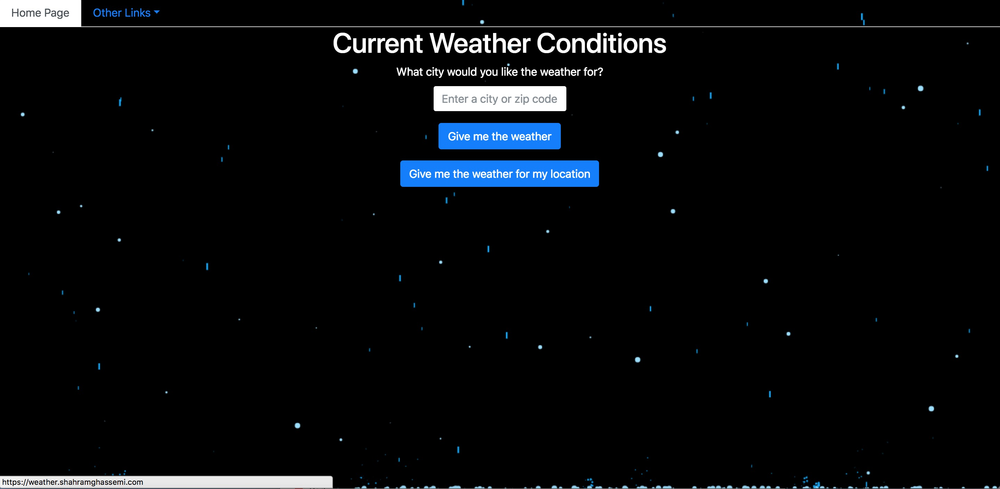
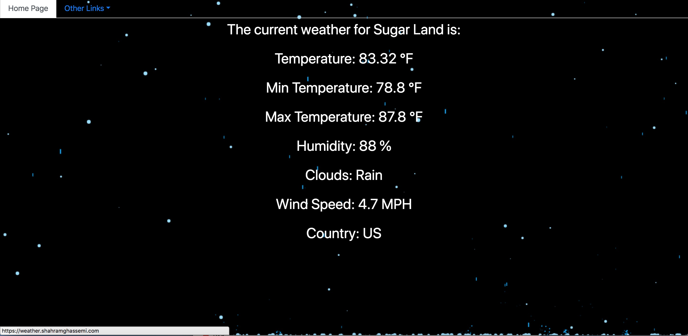
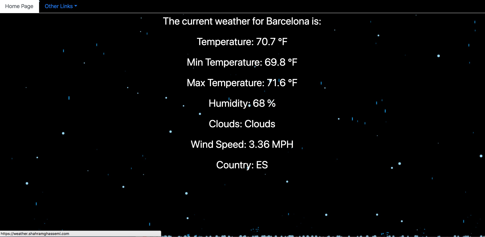

# Current Weather Conditions
Current weather conditions is an app that was developed using Python3, Tornado(back end), Jinja2(templates), Peewee(ORM), Boto3(AWS) and some jQuery for the rain effects. It uses the OpenWeatherMap to get the different weather conditions for the city you input. It also uses the IpInfo API which allows users to get weather conditions based on the ip address that they are using.

The main page gives you two options. You can choose to get the weather based on a city name/zip code, or you may click on the button "Give me the weather for my location" which will give you the weather based on the location of your ip address.

My ip address is located in Sugar Land so I receive the weather for Sugar Land. Wherever you are in the world, as long as you have an ip address you can get the weather for your location.

You can also search for weather in other states and countries.

